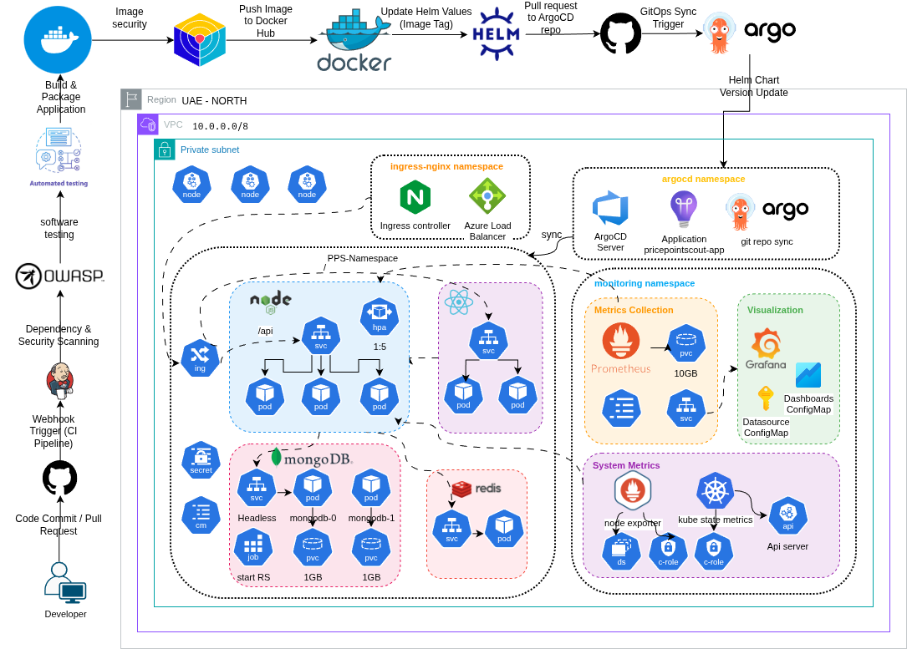
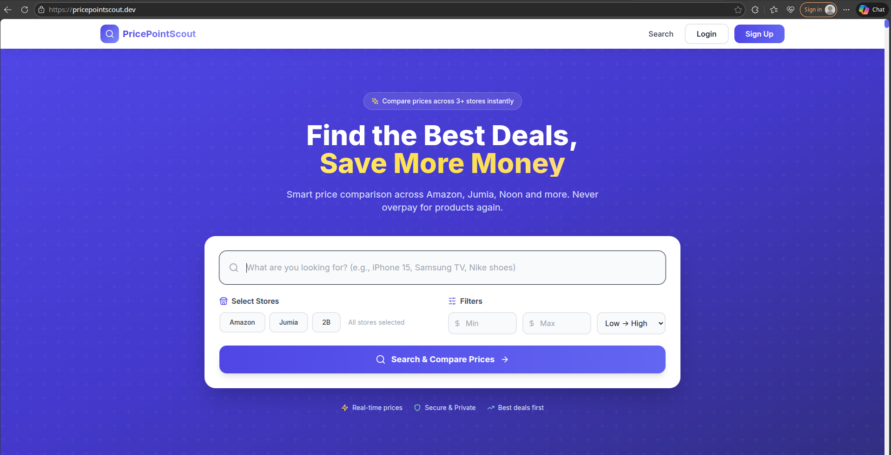
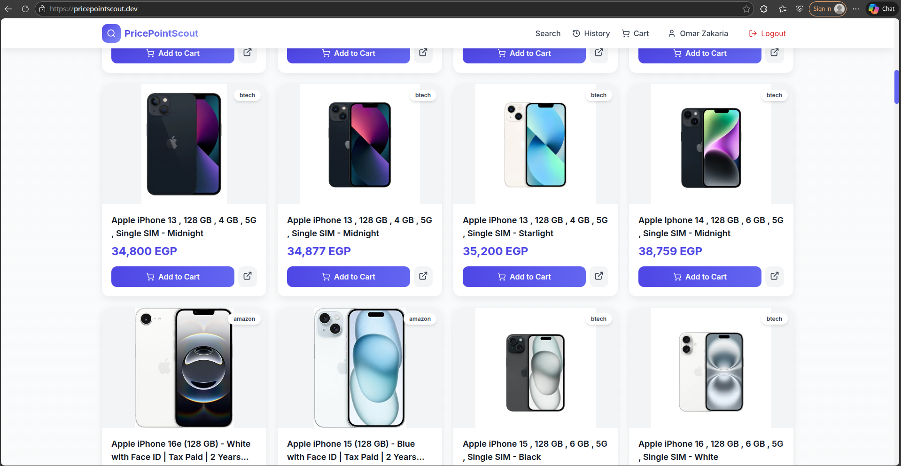
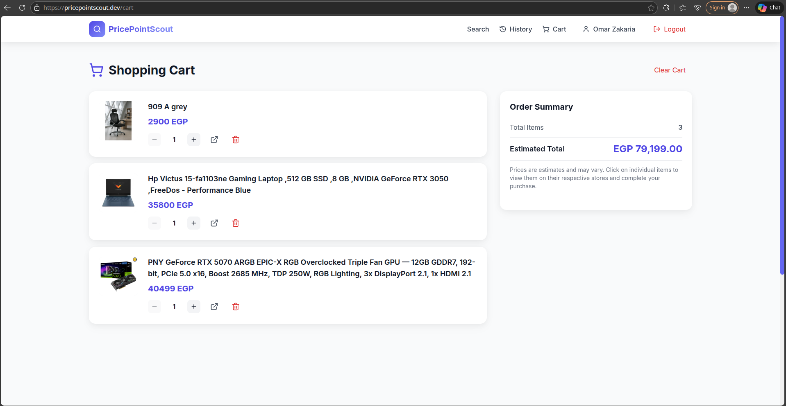
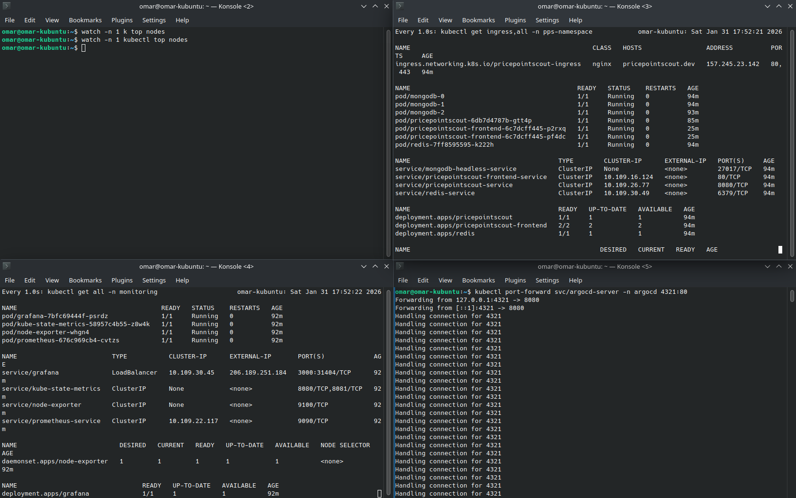
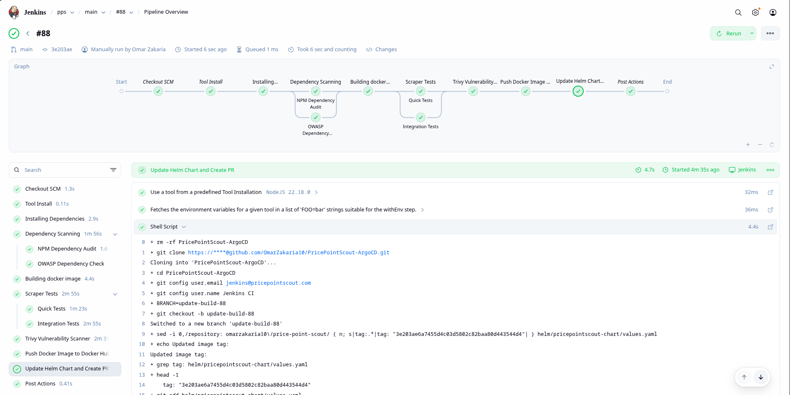
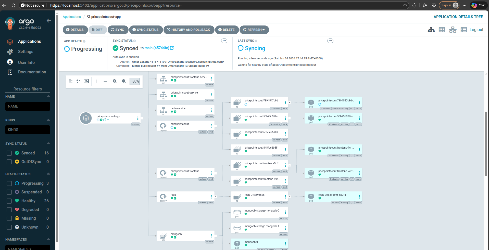
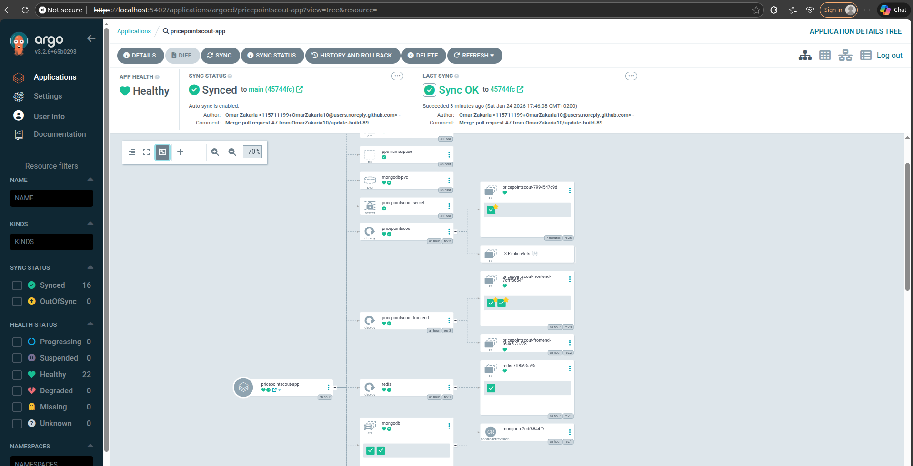
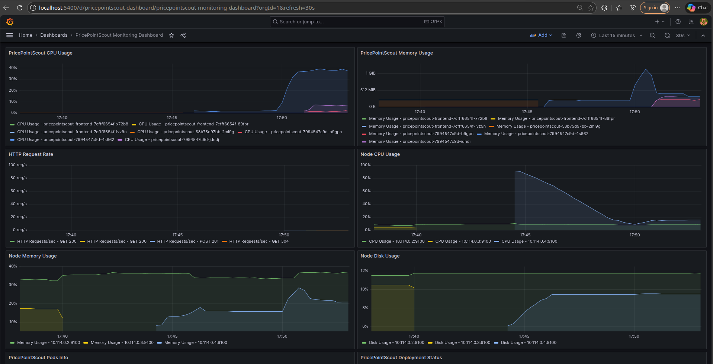

# 🚀 PricePointScout - Enterprise DevOps & Kubernetes Showcase

<div align="center">

[](https://github.com/OmarZakaria10/PricePointScout/actions/workflows/nodetest.yml)
[](https://nodejs.org/)
[](https://mongodb.com/)
[](https://redis.io/)
[](https://kubernetes.io/)
[](https://helm.sh/)
[](https://terraform.io/)
[](https://jenkins.io/)
[](https://argoproj.github.io/cd/)
[](https://cert-manager.io/)
[](https://prometheus.io/)
[](https://grafana.com/)
[](https://kubernetes.io/)

**A Production-Ready E-Commerce Price Comparison Platform Demonstrating Modern Kubernetes & DevOps Practices**

[Features](#-application-features) • [Kubernetes Stack](#-kubernetes-technology-stack) • [Quick Start](#-quick-start) • [Architecture](#-architecture-overview) • [Helm Charts](#-helm-charts)

</div>

---

## 📖 Table of Contents

- [About This Project](#-about-this-project)
- [Complete CI/CD Architecture](#-complete-cicd-architecture)
- [What is PricePointScout?](#-what-is-pricepointscout)
- [Application Features](#-application-features)
- [Helm Charts](#-helm-charts)
- [Jenkins CI/CD Pipeline](#-jenkins-cicd-pipeline)
- [ArgoCD GitOps Deployment](#-argocd-gitops-deployment)
- [Kubernetes Infrastructure](#-kubernetes-infrastructure)
- [Monitoring Stack](#-monitoring-stack)
- [Additional Documentation](#-additional-documentation)
  - [HPA Auto-Scaling](#-horizontal-pod-autoscaler-hpa)
  - [TLS Certificates](#-tls-certificates-with-cert-manager)
  - [Terraform IaC](#-terraform-infrastructure-as-code)
  - [Docker & Ansible](#-docker-containerization)
- [API Reference](#-api-reference)
- [Author](#-author)

---

## 🎯 About This Project

PricePointScout is a **production-ready e-commerce price comparison platform** that demonstrates enterprise-level Kubernetes and DevOps practices. This project combines a real-world application with comprehensive CI/CD automation, GitOps deployment, and cloud-native infrastructure.

---

## 🏗️ Complete CI/CD Architecture



This diagram illustrates the **end-to-end infrastructure** from code commit to production deployment:

**Left Side - CI/CD Pipeline:**
- Developer commits code → GitHub webhook triggers Jenkins
- Jenkins runs security scans (OWASP), automated tests, and builds Docker images
- Trivy scans container images for vulnerabilities
- Images pushed to Docker Hub with Git commit tags
- Jenkins updates Helm values in GitOps repository
- Pull request created for review before deployment

**Right Side - Kubernetes Cluster (UAE North -  Azure):**
- **ArgoCD Namespace** - GitOps controller managing Helm chart deployments
- **Ingress Namespace** - NGINX Ingress + Azure Load Balancer routing traffic
- **PPS Namespace** - Application pods (Backend + Frontend with HPA), MongoDB StatefulSet, Redis cache
- **Monitoring Namespace** - Prometheus + Grafana + Node Exporter + Kube State Metrics

---

## 🛒 What is PricePointScout?

**PricePointScout** is an intelligent **price comparison platform** that helps users find the best deals across multiple e-commerce websites.

### 💰 The Problem
Shoppers waste time manually checking prices across Amazon, Jumia, Noon, ElBadr, and other platforms to find the best deal for a product.

### ✨ The Solution
**Search once, compare everywhere!** PricePointScout searches all major e-commerce platforms simultaneously and displays results in a centralized dashboard, helping users make informed purchasing decisions and save money.

### 🎯 How It Works
1. User enters a product name (e.g., "iPhone 15")
2. Backend scrapes prices from multiple platforms in parallel
3. Results cached in Redis for lightning-fast responses
4. User sees all prices, ratings, and availability in one view
5. Click to buy from the platform with the best price

---

## 💡 Application Features

### 🛍️ Price Comparison Features
| Feature | Description |
|---------|-------------|
| 🔍 **Multi-Platform Search** | Search across Amazon, Jumia, Noon, ElBadr, and 2B simultaneously |
| 💰 **Price Comparison** | Compare prices, ratings, and availability to find the best deal |
| ⚡ **Fast Results** | Redis caching delivers results in <200ms with 85%+ hit ratio |
| 🔄 **Real-Time Scraping** | Puppeteer with stealth plugin for accurate, up-to-date prices |
| 📊 **Centralized Dashboard** | All results displayed in one clean, easy-to-navigate interface |

### 🔐 User Features
| Feature | Description |
|---------|-------------|
| 👤 **User Accounts** | JWT-based authentication with secure HTTP-only cookies |
| 📖 **Search History** | Track your previous searches and price trends |
| ⭐ **Favorites** | Save products and get price drop notifications |
| 📈 **Analytics** | View popular products and trending searches |

### 🛡️ Technical Features
| Feature | Description |
|---------|-------------|
| 🔒 **Enterprise Security** | Rate limiting, XSS protection, input sanitization |
| 📦 **MongoDB Storage** | Scalable database with replica sets for high availability |
| 🚀 **Redis Caching** | In-memory caching for sub-second response times |
| 📝 **Structured Logging** | Winston logger for debugging and monitoring |
| 📊 **Prometheus Metrics** | Custom metrics for observability |

---

## ⎈ Helm Charts

### Overview

This project uses **two comprehensive Helm charts** to deploy the complete infrastructure:
1. **pricepointscout-chart** - Application stack (Backend, Frontend, MongoDB, Redis)
2. **monitoring-chart** - Observability stack (Prometheus, Grafana, Exporters)

```
┌─────────────────────────────────────────────────────────────────────────────┐
│                        KUBERNETES PRODUCTION STACK                          │
├─────────────────────────────────────────────────────────────────────────────┤
│                                                                             │
│  ┌─────────────────────────────────────────────────────────────────────┐    │
│  │                    INGRESS LAYER (NGINX + TLS)                      │    │
│  │   ┌─────────────────┐    ┌─────────────────┐    ┌───────────────┐   │    │
│  │   │  Let's Encrypt  │──▶│  NGINX Ingress  │──▶│ Path Routing  │   │    │
│  │   │  Cert-Manager   │    │  Controller     │    │ /api → Backend│   │    │
│  │   └─────────────────┘    └─────────────────┘    │ /   → Frontend│   │    │
│  │                                                 └───────────────┘   │    │
│  └─────────────────────────────────────────────────────────────────────┘    │
│                                      │                                      │
│  ┌─────────────────────────────────────────────────────────────────────┐    │
│  │                     APPLICATION LAYER (HPA Enabled)                 │    │
│  │   ┌──────────────┐   ┌──────────────┐   ┌──────────────────────┐    │    │
│  │   │   Backend    │   │   Frontend   │   │         HPA          │    │    │
│  │   │   Pods (3)   │   │   Pods (2)   │   │  CPU: 70% | Mem: 75% │    │    │
│  │   │  (Node.js)   │   │   (React)    │   │  Min: 1  | Max: 5    │    │    │
│  │   └──────────────┘   └──────────────┘   └──────────────────────┘    │    │
│  └─────────────────────────────────────────────────────────────────────┘    │
│                                      │                                      │
│  ┌─────────────────────────────────────────────────────────────────────┐    │
│  │                        DATA LAYER (StatefulSets)                    │    │
│  │   ┌──────────────────────────┐    ┌─────────────────────────────┐   │    │
│  │   │    MongoDB StatefulSet   │    │         Redis Cache         │   │    │
│  │   │    (2 replicas + PVC)    │    │      (High Performance)     │   │    │
│  │   └──────────────────────────┘    └─────────────────────────────┘   │    │
│  └─────────────────────────────────────────────────────────────────────┘    │
│                                                                             │
│  ┌─────────────────────────────────────────────────────────────────────┐    │
│  │                      MONITORING NAMESPACE                           │    │
│  │   ┌────────────┐  ┌────────────┐  ┌──────────────┐  ┌────────────┐  │    │
│  │   │ Prometheus │  │  Grafana   │  │Node Exporter │  │ Kube State │  │    │
│  │   │  (10Gi PV) │  │ Dashboards │  │  DaemonSet   │  │  Metrics   │  │    │
│  │   └────────────┘  └────────────┘  └──────────────┘  └────────────┘  │    │
│  └─────────────────────────────────────────────────────────────────────┘    │
│                                                                             │
└─────────────────────────────────────────────────────────────────────────────┘
```

| Category | Technologies |
|----------|-------------|
| **Orchestration** | Kubernetes (AKS, Minikube), Helm 3, HPA |
| **Ingress** | NGINX Ingress Controller, Path-based Routing |
| **TLS/SSL** | Cert-Manager, Let's Encrypt (ACME HTTP01) |
| **Monitoring** | Prometheus, Grafana, Node Exporter, Kube State Metrics |
| **CI/CD** | Jenkins Pipelines, ArgoCD GitOps |
| **Infrastructure** | Terraform (Azure AKS) |
| **Security** | Trivy, OWASP Dependency Check, npm audit |
| **Containerization** | Docker, Multi-stage Builds |

---

## 🏗 Architecture Overview

```
                              ┌─────────────────────────────────────────────────┐
                              │              KUBERNETES CLUSTER                 │
                              │                                                 │
   HTTPS Traffic              │  ┌───────────────────────────────────────────┐  │
        │                     │  │           INGRESS CONTROLLER              │  │
        ▼                     │  │  ┌────────────────────────────────────┐   │  │
┌──────────────┐              │  │  │  NGINX + TLS (Let's Encrypt)       │   │  │
│   Internet   │────────────▶│  │  │  • cert-manager.io/cluster-issuer  │   │  │
│   Users      │              │  │  │  • letsencrypt-prod                │   │  │
└──────────────┘              │  │  └────────────────┬───────────────────┘   │  │
                              │  └───────────────────┼───────────────────────┘  │
                              │                      │                          │
                              │         ┌────────────┴────────────┐             │
                              │         │                         │             │
                              │         ▼                         ▼             │
                              │  ┌─────────────┐          ┌─────────────┐       │
                              │  │ /api/*      │          │ /*          │       │
                              │  │ Backend     │          │ Frontend    │       │
                              │  │ Service     │          │ Service     │       │
                              │  └──────┬──────┘          └──────┬──────┘       │
                              │         │                        │              │
                              │         ▼                        ▼              │
                              │  ┌─────────────────┐     ┌─────────────────┐    │
                              │  │  Backend Pods   │     │  Frontend Pods  │    │
                              │  │  (HPA: 1-5)     │     │  (Replicas: 2)  │    │
                              │  │  ┌───┐ ┌───┐    │     │  ┌───┐ ┌───┐    │    │
                              │  │  │Pod│ │Pod│    │     │  │Pod│ │Pod│    │    │
                              │  │  └───┘ └───┘    │     │  └───┘ └───┘    │    │
                              │  └────────┬────────┘     └─────────────────┘    │
                              │           │                                     │
                              │           ▼                                     │
                              │  ┌─────────────────────────────────────────┐    │
                              │  │           DATA LAYER                    │    │
                              │  │  ┌─────────────────┐ ┌────────────────┐ │    │
                              │  │  │ MongoDB         │ │ Redis          │ │    │
                              │  │  │ StatefulSet     │ │ Deployment     │ │    │
                              │  │  │ (2 replicas)    │ │ (Cache Layer)  │ │    │
                              │  │  │ + PVC Storage   │ │                │ │    │
                              │  │  └─────────────────┘ └────────────────┘ │    │ 
                              │  └─────────────────────────────────────────┘    │
                              │                                                 │
                              │  ┌─────────────────────────────────────────┐    │
                              │  │       MONITORING NAMESPACE              │    │
                              │  │  ┌──────────┐ ┌──────────┐ ┌──────────┐ │    │
                              │  │  │Prometheus│ │ Grafana  │ │  Node    │ │    │
                              │  │  │ + PVC    │ │Dashboard │ │ Exporter │ │    │
                              │  │  │ (10Gi)   │ │          │ │DaemonSet │ │    │
                              │  │  └──────────┘ └──────────┘ └──────────┘ │    │
                              │  └─────────────────────────────────────────┘    │
                              └─────────────────────────────────────────────────┘
```

---

## 🚀 Quick Start

### Option 1: Local Docker Compose (Fastest)

```bash
# Clone the repository
git clone https://github.com/OmarZakaria10/PricePointScout.git
cd PricePointScout

# Start all services
docker-compose up -d

# Verify services are running
docker-compose ps

# Access the application
curl http://localhost:8080/health
```
<!-- 
### Option 2: Local Kubernetes (Minikube)

```bash
# Start Minikube
minikube start --memory=4096 --cpus=2

# Deploy the application
cd kubernetes-minikube
./script.bash

# Get the service URL
minikube service pricepointscout-service --url -->
<!-- ``` -->

### Option 2: Production Kubernetes with Helm (Recommended)

```bash

# Install cert-manager for TLS (if not already installed)
kubectl apply -f https://github.com/cert-manager/cert-manager/releases/download/v1.13.0/cert-manager.yaml

# install nginx Ingress controller
kubectl apply -f https://raw.githubusercontent.com/kubernetes/ingress-nginx/controller-v1.10.1/deploy/static/provider/cloud/deploy.yaml

# install metrics-server
kubectl apply -f https://github.com/kubernetes-sigs/metrics-server/releases/latest/download/components.yaml

# Install ArgoCD
kubectl create namespace argocd
kubectl apply -n argocd -f https://raw.githubusercontent.com/argoproj/argo-cd/stable/manifests/install.yaml

# Deploy Application Stack
cd helm
helm install pricepointscout ./pricepointscout-chart \
  -n pps-namespace --create-namespace

# Deploy Monitoring Stack
helm install monitoring ./monitoring-chart \
  -n monitoring --create-namespace

# Verify deployments
kubectl get pods -n pps-namespace
kubectl get pods -n monitoring
```

---

## 📚 Detailed Documentation

---

## ⎈ Helm Charts

### What I Built

Two comprehensive Helm charts: one for the complete application stack and one for the monitoring infrastructure.

### Helm Charts Structure

```
helm/
├── pricepointscout-chart/           # Application Stack
│   ├── Chart.yaml
│   ├── values.yaml                  # All configurable values
│   └── templates/
│       ├── app/
│       │   ├── app-deployment.yaml       # Backend deployment
│       │   ├── app-frontend-deployment.yaml  # React frontend
│       │   ├── app-hpa.yaml              # ⭐ Horizontal Pod Autoscaler
│       │   ├── app-ingress.yaml          # ⭐ NGINX Ingress + TLS
│       │   ├── clusterissuer.yaml        # ⭐ Let's Encrypt issuer
│       │   ├── app-configmap.yaml
│       │   ├── app-secret.yaml
│       │   └── app-service.yaml
│       ├── mongodb/
│       │   ├── mongodb-statefulset.yaml  # MongoDB with PVC
│       │   ├── mongodb-headless-service.yaml
│       │   └── mongodb-pvc.yaml
│       └── redis/
│           ├── redis-deployment.yaml
│           └── redis-service.yaml
│
└── monitoring-chart/                # Monitoring Stack
    ├── Chart.yaml
    ├── values.yaml
    └── templates/
        ├── prometheus-deployment.yaml
        ├── grafana-deployment.yaml
        ├── node-exporter-daemonset.yaml
        └── kube-state-metrics-deployment.yaml
```


### How to Deploy

**Install Application Chart:**
```bash
cd helm

# Install with default values
helm install pricepointscout ./pricepointscout-chart -n pps-namespace --create-namespace

# Install with custom values
helm install pricepointscout ./pricepointscout-chart \
  -n pps-namespace --create-namespace \
  --set hpa.maxReplicas=10 \
  --set ingress.host="myapp.example.com" \
  --set ingress.tls.enabled=true
```

**Install Monitoring Chart:**
```bash
helm install monitoring ./monitoring-chart -n monitoring --create-namespace
```

**Management Commands:**
```bash
# List releases
helm list -A

# Upgrade
helm upgrade pricepointscout ./pricepointscout-chart -n pps-namespace

# Rollback
helm rollback pricepointscout 1 -n pps-namespace
```

---

## 🔧 Jenkins CI/CD Pipeline

### Overview

Multi-stage Jenkins pipeline with **parallel execution**, **security scanning**, and **GitOps integration**.

### Pipeline Stages

```
┌─────────────────────────────────────────────────────────────┐
│                   JENKINS PIPELINE                          │
├─────────────────────────────────────────────────────────────┤
│  1. Install Dependencies                                    │
│  2. Security Scanning (Parallel: npm audit + OWASP)         │
│  3. Build Docker Image                                      │
│  4. Testing (Parallel: Quick tests + Integration tests)     │
│  5. Trivy Container Security Scan                           │
│  6. Push to Docker Hub                                      │
│  7. Update GitOps Repo → Create PR                          │
└─────────────────────────────────────────────────────────────┘
```


### Security Scanning

| Scanner | Purpose | Trigger |
|---------|---------|---------|
| **npm audit** | Dependency vulnerabilities | All branches |
| **OWASP Dependency Check** | Comprehensive CVE scanning | main/PR |
| **Trivy** | Container image vulnerabilities | All branches |

### Key Features

- ✅ **Parallel Execution** - Faster builds (6-8 minutes)
- ✅ **Security First** - OWASP + Trivy + npm audit
- ✅ **Docker-based Testing** - Environment consistency
- ✅ **GitOps Integration** - Automatic PR creation for ArgoCD
- ✅ **Conditional Stages** - Based on branch (main/PR/feature)

---

## 🔄 ArgoCD GitOps Deployment

### Overview

**GitOps-based continuous deployment** - ArgoCD monitors the Git repository and automatically syncs Helm charts to the Kubernetes cluster.

### How It Works

1. **Jenkins updates** Git repository with new image tag
2. **Jenkins creates PR** for review
3. **ArgoCD detects** changes after PR merge
4. **ArgoCD syncs** Helm chart to cluster automatically

### ArgoCD + Helm Integration

**Key Point:** This project uses **ArgoCD to deploy Helm charts**, combining GitOps automation with Helm's templating power.

**ArgoCD Application Configuration:**
```yaml
apiVersion: argoproj.io/v1alpha1
kind: Application
metadata:
  name: pricepointscout
  namespace: argocd
spec:
  project: default
  source:
    repoURL: https://github.com/OmarZakaria10/PricePointScout-ArgoCD.git
    targetRevision: main
    path: helm/pricepointscout-chart  # 🎯 Helm Chart Path
    helm:
      releaseName: pricepointscout
  destination:
    server: https://kubernetes.default.svc
    namespace: pps-namespace
  syncPolicy:
    automated:
      prune: false
      selfHeal: true
```

### 📸 ArgoCD Managing Helm Deployments

**ArgoCD Application Dashboard:**



### Benefits

- ✅ **Declarative Deployments** - Everything in Git
- ✅ **Automated Sync** - Continuous monitoring
- ✅ **Easy Rollbacks** - Git history enables instant rollbacks
- ✅ **Helm Templating** - Reusable, configurable manifests

---

## ☸️ Kubernetes Infrastructure

### What I Built

Automatic scaling based on CPU and Memory utilization to handle traffic spikes efficiently.

### HPA Configuration

```yaml
# From helm/pricepointscout-chart/templates/app/app-hpa.yaml
apiVersion: autoscaling/v2
kind: HorizontalPodAutoscaler
metadata:
  name: pricepointscout-hpa
  namespace: {{ .Values.app.namespace }}
spec:
  scaleTargetRef:
    apiVersion: apps/v1
    kind: Deployment
    name: pricepointscout
  minReplicas: {{ .Values.hpa.minReplicas }}      # Default: 1
  maxReplicas: {{ .Values.hpa.maxReplicas }}      # Default: 5
  metrics:
  - type: Resource
    resource:
      name: cpu
      target:
        type: Utilization
        averageUtilization: {{ .Values.hpa.metrics.cpu.averageUtilization }}  # 70%
  - type: Resource
    resource:
      name: memory
      target:
        type: Utilization
        averageUtilization: {{ .Values.hpa.metrics.memory.averageUtilization }}  # 75%
```

### Configurable Values

```yaml
# values.yaml - HPA Configuration
hpa:
  minReplicas: 1        # Minimum pods (cost-effective baseline)
  maxReplicas: 5        # Maximum pods during peak load
  metrics:
    cpu:
      averageUtilization: 70    # Scale up when CPU > 70%
    memory:
      averageUtilization: 75    # Scale up when Memory > 75%
```

### How to Use

**Monitor HPA Status:**
```bash
# View current HPA status
kubectl get hpa -n pps-namespace

# Watch HPA in real-time
kubectl get hpa -n pps-namespace -w

# Detailed HPA information
kubectl describe hpa pricepointscout-hpa -n pps-namespace
```

**Example Output:**
```
NAME                   REFERENCE                  TARGETS           MINPODS   MAXPODS   REPLICAS
pricepointscout-hpa    Deployment/pricepointscout cpu: 45%/70%      1         5         2
                                                   memory: 60%/75%
```

**Customize HPA via Helm:**
```bash
# Deploy with custom HPA settings
helm upgrade pricepointscout ./pricepointscout-chart \
  -n pps-namespace \
  --set hpa.minReplicas=2 \
  --set hpa.maxReplicas=10 \
  --set hpa.metrics.cpu.averageUtilization=60
```

### HPA Scaling Behavior
| Condition | Action |
### Overview

Production-ready Kubernetes deployment with:
- **NGINX Ingress** - Load balancing and path-based routing
- **HPA** - Auto-scaling based on CPU/Memory (1-5 replicas)
- **StatefulSets** - MongoDB with persistent storage
- **Deployments** - Backend, Frontend, Redis
- **TLS** - Automated certificates from Let's Encrypt

### 📸 Kubernetes Cluster Running


*All components running: Backend pods (with HPA), Frontend replicas, MongoDB StatefulSet, Redis cache*

**NGINX Ingress with TLS:**


*NGINX Ingress Controller with automatic TLS certificates from Let's Encrypt*

**HPA Active Scaling:**


*Horizontal Pod Autoscaler monitoring resources and adjusting replicas (1-5 pods)*

### Key Features

| Feature | Implementation |
|---------|---------------|
| **Auto-Scaling** | HPA scales pods based on CPU 70% / Memory 75% thresholds |
| **Load Balancing** | NGINX Ingress distributes traffic: `/api` → Backend, `/` → Frontend |
| **Persistence** | MongoDB StatefulSet with 1GB PVCs per replica |
| **Caching** | Redis deployment for sub-second response times |
| **TLS/HTTPS** | Automated certificates via cert-manager + Let's Encrypt |
| **Health Checks** | Liveness and readiness probes for self-healing |

---

## 📊 Monitoring Stack

### Overview

Complete observability with **Prometheus** for metrics collection and **Grafana** for visualization.

### Stack Components

| Component | Purpose | Deployment |
|-----------|---------|------------|
| **Prometheus** | Metrics collection & storage (10GB PVC) | Deployment |
| **Grafana** | Dashboards & visualization | Deployment |
| **Node Exporter** | System-level metrics (CPU, memory, disk) | DaemonSet |
| **Kube State Metrics** | Kubernetes object states | Deployment |

### 📸 Monitoring Stack in Production

**Grafana Dashboard:**



### How to Access

```bash
# Access Grafana
kubectl port-forward svc/grafana 3000:3000 -n monitoring
# http://localhost:3000 (admin/admin123)

# Access Prometheus
kubectl port-forward svc/prometheus-service 9090:9090 -n monitoring
# http://localhost:9090
```

---

## 📚 Additional Documentation

---

### 📈 Horizontal Pod Autoscaler (HPA)

### What I Built

Automated TLS certificate provisioning using Let's Encrypt with HTTP01 challenge.

### ClusterIssuer Configuration

```yaml
# From helm/pricepointscout-chart/templates/app/clusterissuer.yaml
apiVersion: cert-manager.io/v1
kind: ClusterIssuer
metadata:
  name: letsencrypt-prod
spec:
  acme:
    # Let's Encrypt production server
    server: https://acme-v02.api.letsencrypt.org/directory

    # Email for certificate expiration notifications
    email: omarzakaria439@gmail.com

    # Secret to store the ACME account private key
    privateKeySecretRef:
      name: letsencrypt-prod-key

    # ACME challenge solver using HTTP01
    solvers:
      - http01:
          ingress:
            class: nginx
```

### Ingress with TLS

```yaml
# From helm/pricepointscout-chart/templates/app/app-ingress.yaml
apiVersion: networking.k8s.io/v1
kind: Ingress
metadata:
  name: pricepointscout-ingress
  namespace: {{ .Values.app.namespace }}
  annotations:
    # Cert-manager annotations for automatic TLS
    cert-manager.io/cluster-issuer: "letsencrypt-prod"
    
    # Security headers
    nginx.ingress.kubernetes.io/proxy-real-ip-cidr: "0.0.0.0/0"
    nginx.ingress.kubernetes.io/use-forwarded-headers: "true"
    
    # Timeouts for scraping operations (up to 3 minutes)
    nginx.ingress.kubernetes.io/proxy-read-timeout: "180"
spec:
  ingressClassName: nginx
  tls:
  - hosts:
    - {{ .Values.ingress.host }}          # e.g., pricepointscout.dev
    secretName: {{ .Values.ingress.tls.secretName }}  # pricepointscout-tls
  rules:
  - host: {{ .Values.ingress.host }}
    http:
      paths:
      - path: /api
        pathType: Prefix
        backend:
          service:
            name: pricepointscout-service
            port:
              number: 8080
      - path: /
        pathType: Prefix
        backend:
          service:
            name: pricepointscout-frontend-service
            port:
              number: 80
```

### TLS Configuration in values.yaml

```yaml
# Ingress Configuration
ingress:
  enabled: true
  className: nginx
  host: "pricepointscout.dev"   # Your domain
  
  # TLS Configuration
  tls:
    enabled: true
    secretName: pricepointscout-tls
  
  annotations:
    cert-manager.io/cluster-issuer: "letsencrypt-prod"
```

### How to Use

**Prerequisites - Install Cert-Manager:**
```bash
# Install cert-manager
kubectl apply -f https://github.com/cert-manager/cert-manager/releases/download/v1.13.0/cert-manager.yaml

# Verify installation
kubectl get pods -n cert-manager
```

**Deploy with TLS Enabled:**
```bash
# Deploy with your domain
helm install pricepointscout ./pricepointscout-chart \
  -n pps-namespace --create-namespace \
  --set ingress.host="yourdomain.com" \
  --set ingress.tls.enabled=true
```

**Verify Certificate:**
```bash
# Check certificate status
kubectl get certificate -n pps-namespace

# View certificate details
kubectl describe certificate pricepointscout-tls -n pps-namespace

# Check the secret created by cert-manager
kubectl get secret pricepointscout-tls -n pps-namespace
```

**Expected Certificate Status:**
```
NAME                  READY   SECRET                AGE
pricepointscout-tls   True    pricepointscout-tls   5m
```

### TLS Flow
```
┌─────────────┐    ┌──────────────┐    ┌──────────────┐    ┌─────────────┐
│   Ingress   │──▶│ Cert-Manager │──▶│ Let's Encrypt│ ─▶│ Certificate │
│  (TLS Req)  │    │  Controller  │    │    ACME      │    │   Secret    │
└─────────────┘    └──────────────┘    └──────────────┘    └─────────────┘
```

---

## 📊 Monitoring Stack

### What I Built

Complete observability solution with Prometheus for metrics, Grafana for visualization, Node Exporter for system metrics, and Kube State Metrics for Kubernetes object states.

### Stack Components

| Component | Purpose | Image Version |
|-----------|---------|---------------|
| **Prometheus** | Metrics collection, storage, alerting | v2.45.0 |
| **Grafana** | Dashboards and visualization | 10.0.0 |
| **Node Exporter** | System-level metrics (CPU, memory, disk) | v1.6.0 |
| **Kube State Metrics** | Kubernetes object states | v2.9.2 |

### Prometheus Configuration

```yaml
# values.yaml - Prometheus settings
prometheus:
  enabled: true
  replicas: 1
  image:
    repository: prom/prometheus
    tag: v2.45.0
  
  resources:
    requests:
      cpu: 100m
      memory: 256Mi
    limits:
      cpu: 500m
      memory: 1Gi
  
  # Persistent storage for metrics
  storage:
    enabled: true
    storageClass: "do-block-storage"  # Or "managed-csi" for Azure
    size: 10Gi
  
  # Scrape configuration
  scrapeInterval: 15s
  retention: 7d
  
  # Namespaces to monitor
  targetNamespaces:
    - pps-namespace
    - monitoring
```

### Grafana Configuration

```yaml
# values.yaml - Grafana settings
grafana:
  enabled: true
  image:
    repository: grafana/grafana
    tag: 10.0.0
  
  service:
    type: LoadBalancer
    port: 3000
  
  # Admin credentials
  adminUser: admin
  adminPassword: admin123  # Change this!
  
  # Auto-configured Prometheus datasource
  datasources:
    prometheus:
      url: http://prometheus-service:9090
```

### How to Use

**Install Monitoring Stack:**
```bash
cd helm

# Install with defaults
helm install monitoring ./monitoring-chart -n monitoring --create-namespace

# With custom settings
helm install monitoring ./monitoring-chart \
  -n monitoring --create-namespace \
  --set grafana.adminPassword=securePassword \
  --set prometheus.storage.size=20Gi
```

**Verify Installation:**
```bash
# Check all pods are running
kubectl get pods -n monitoring

# Expected output:
# prometheus-xxxxx          1/1     Running
# grafana-xxxxx             1/1     Running
# node-exporter-xxxxx       1/1     Running (one per node)
# kube-state-metrics-xxxxx  1/1     Running

# Check services
kubectl get svc -n monitoring

# Check persistent volume
kubectl get pvc -n monitoring
```

**Access Grafana:**
```bash
# Get LoadBalancer IP
kubectl get svc grafana -n monitoring

# Or port-forward for local access
kubectl port-forward svc/grafana 3000:3000 -n monitoring

# Access at http://localhost:3000
# Username: admin
# Password: admin123 (or your custom password)
```

**Access Prometheus:**
```bash
# Port-forward Prometheus
kubectl port-forward svc/prometheus-service 9090:9090 -n monitoring

# Access at http://localhost:9090
```

### Useful Prometheus Queries

```promql
# Request rate per second
rate(http_requests_total[5m])

# Error rate percentage
rate(http_requests_total{status=~"5.."}[5m]) / rate(http_requests_total[5m]) * 100

# 95th percentile response time
histogram_quantile(0.95, rate(http_response_time_seconds_bucket[5m]))

# Pod CPU usage
rate(container_cpu_usage_seconds_total{namespace="pps-namespace"}[5m])

# Pod memory usage
container_memory_usage_bytes{namespace="pps-namespace"}

# HPA current replicas
kube_horizontalpodautoscaler_status_current_replicas{hpa="pricepointscout-hpa"}
```

### Pre-configured Dashboards

The monitoring chart includes pre-configured Grafana dashboards:
- **Application Metrics** - Request rates, response times, error rates
- **Kubernetes Cluster** - Node health, pod status, resource usage
- **Node Exporter** - System metrics per node

---

## 🏗️ Terraform Infrastructure as Code

Azure AKS cluster provisioning with Terraform for reproducible infrastructure.

```bash
cd terraform-AKS-Azure

# Initialize Terraform
terraform init

# Preview changes
terraform plan -var="node_count=3"

# Apply infrastructure
terraform apply

# Get Kubernetes credentials
az aks get-credentials \
  --resource-group $(terraform output -raw resource_group_name) \
  --name $(terraform output -raw kubernetes_cluster_name)
```

---

## 🐳 Docker Containerization

Production-optimized Docker setup with multi-stage builds.

```bash
# Start all services
docker-compose up -d

# View logs
docker-compose logs -f app

# Scale application
docker-compose up -d --scale app=3

# Stop and cleanup
docker-compose down -v
```

---

## 📡 Ansible Automation

Server configuration automation for Docker installation and application deployment.

```bash
cd ansible

# Run on all hosts
ansible-playbook -i hosts.ini main.yaml

# Dry-run (check mode)
ansible-playbook -i hosts.ini main.yaml --check --diff
```

---

## 🔌 API Reference

### Health & Metrics

| Endpoint | Method | Description |
|----------|--------|-------------|
| `/health` | GET | Application health check |
| `/metrics` | GET | Prometheus metrics |

### Authentication

| Endpoint | Method | Description |
|----------|--------|-------------|
| `/api/v1/users/signup` | POST | Register new user |
| `/api/v1/users/login` | POST | User login |
| `/api/v1/users/logout` | GET | User logout |

### Product Scraping

| Endpoint | Method | Description |
|----------|--------|-------------|
| `/api/v1/scrape` | GET | Scrape products (guest) |
| `/api/v1/scrape/auth` | GET | Scrape products (authenticated) |

### Quick Test

```bash
# Health check
curl http://localhost:8080/health

# Search products
curl "http://localhost:8080/api/v1/scrape?keyword=iphone&sources=amazon,jumia"
```

---

## 📊 Project Summary

### Key Kubernetes Features

| Feature | Implementation |
|---------|---------------|
| ⎈ **Helm Charts** | 2 charts (app + monitoring) |
| 📈 **HPA** | CPU 70% / Memory 75% scaling |
| 🔐 **TLS** | Let's Encrypt with cert-manager |
| 📊 **Monitoring** | Prometheus + Grafana + Node Exporter |
| 🔄 **GitOps** | ArgoCD auto-deployment |
| 🛡️ **Security** | Trivy + OWASP scanning |

### Performance Benchmarks

| Metric | Value |
|--------|-------|
| API Response Time | <200ms average |
| Cache Hit Ratio | 85%+ |
| HPA Scaling Response | <30 seconds |
| CI/CD Pipeline Time | 6-8 minutes |

---

## 🛠 Prerequisites

| Tool | Version | Purpose |
|------|---------|---------|
| kubectl | 1.28+ | Kubernetes CLI |
| Helm | 3.12+ | Package manager |
| Docker | 20+ | Containerization |
| Terraform | 1.5+ | Infrastructure (Azure AKS) |

---

## 👨‍💻 Author

**Omar Zakaria** - DevOps Engineer

[](https://github.com/OmarZakaria10)
[](https://www.linkedin.com/in/omar-zakaria-809aa51b9/)

---

## 📝 License

This project is licensed under the MIT License - see the [LICENSE](LICENSE) file for details.

---

<div align="center">

**⭐ Star this repository if you found it helpful!**

*Built with ❤️ to demonstrate modern Kubernetes, Helm, and DevOps practices*

**Key Technologies: Kubernetes | Helm | HPA | TLS/Cert-Manager | Prometheus | Grafana | ArgoCD | Jenkins | Terraform**

</div>
